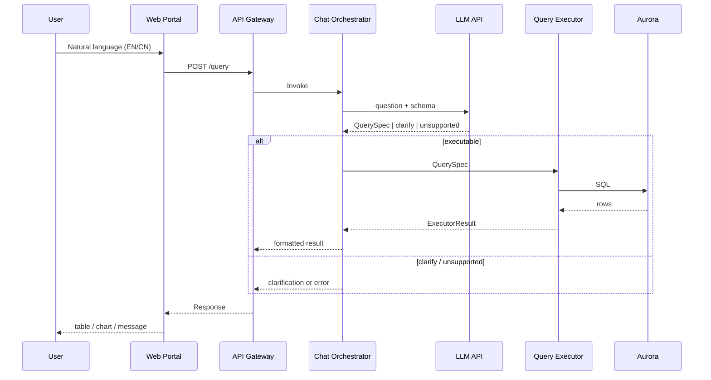

# Flow Diagrams

Three PlantUML diagram files describe the solution flow:

| File | Description |
|------|-------------|
| [flow.puml](./flow.puml) | **Sequence diagram** — End-to-end flow from User → Web → API Gateway → Orchestrator → LLM → Executor → DB → back to User. Includes decision branches (executable / clarify / unsupported). |
| [flow_activity.puml](./flow_activity.puml) | **Activity diagram** — Chat Orchestrator internal decision flow and steps. |
| [flow_component.puml](./flow_component.puml) | **Component diagram** — Architecture with this project’s modules and external components. |

## Viewing PlantUML

- **VS Code**: Install extension “PlantUML” (jebbs.plantuml), then `Alt+D` to preview.
- **Online**: Paste content at [plantuml.com/plantuml](https://www.plantuml.com/plantuml/uml/).
- **CLI**: `java -jar plantuml.jar docs/flow.puml` to generate PNG/SVG.

## Quick Mermaid Preview

