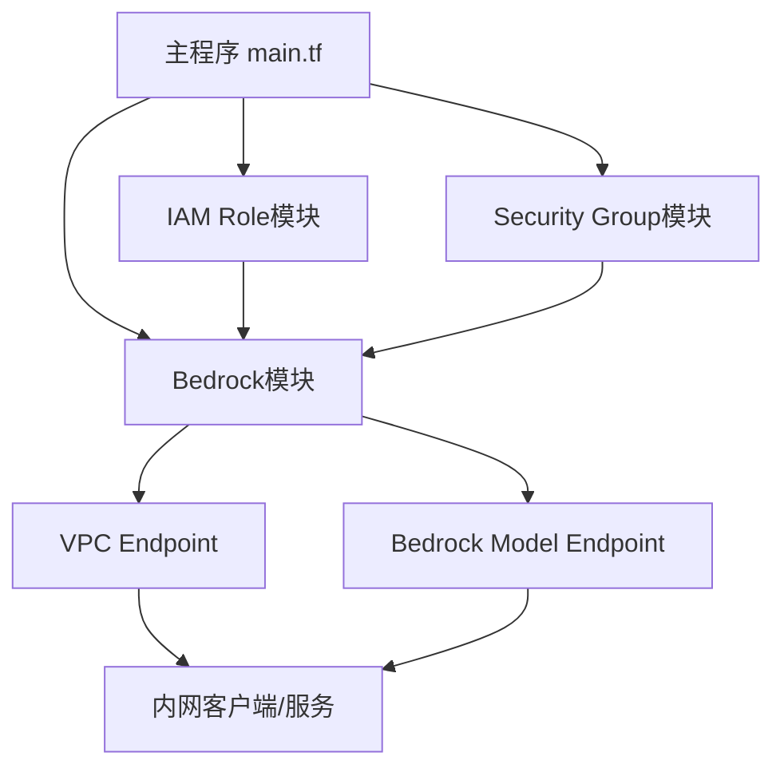

# AWS Bedrock Terraform Module

## 作用
本模块用于在指定VPC的私有子网内，通过VPC Endpoint部署AWS Bedrock大模型服务。支持自定义模型类型、参数、VPC、子网等。

## 架构设计
本模块设计为在主程序中与其他模块配合使用：
- **主程序** (`main/main.tf`) 调用三个模块：
  1. IAM Role模块（现有）
  2. Security Group模块（现有）
  3. Bedrock模块（本模块）
- **Bedrock模块** 使用IAM和SG模块创建的资源

## 使用方法
在主程序中调用：
```hcl
# 调用现有的IAM Role模块
module "bedrock_iam_role" {
  source = "../modules/iam-role"  # 您的IAM模块路径
  
  role_name = "${var.bedrock_model_name}-role"
  policies = [
    {
      name = "BedrockAccessPolicy"
      policy = jsonencode({
        Version = "2012-10-17"
        Statement = [
          {
            Effect = "Allow"
            Action = [
              "bedrock:InvokeModel",
              "bedrock:InvokeModelWithResponseStream",
              "bedrock:ListFoundationModels",
              "bedrock:GetFoundationModel"
            ]
            Resource = "*"
          }
        ]
      })
    }
  ]
  managed_policy_arns = ["arn:aws:iam::aws:policy/AmazonBedrockFullAccess"]
  tags = var.tags
}

# 调用现有的Security Group模块
module "bedrock_security_group" {
  source = "../modules/security-group"  # 您的SG模块路径
  
  vpc_id = var.vpc_id
  name   = "${var.bedrock_model_name}-sg"
  ingress_rules = [
    {
      port        = 443
      protocol    = "tcp"
      cidr_blocks = var.allowed_cidr_blocks
      description = "HTTPS access from allowed CIDR blocks"
    }
  ]
  egress_rules = [
    {
      port        = 0
      protocol    = "-1"
      cidr_blocks = ["0.0.0.0/0"]
      description = "Allow all outbound traffic"
    }
  ]
  tags = var.tags
}

# 调用Bedrock模块
module "bedrock" {
  source = "../modules/bedrock"
  
  vpc_id                         = var.vpc_id
  private_subnet_ids             = var.private_subnet_ids
  bedrock_model_id               = var.bedrock_model_id
  bedrock_model_name             = var.bedrock_model_name
  bedrock_model_parameters       = var.bedrock_model_parameters
  vpc_endpoint_security_group_ids = [module.bedrock_security_group.security_group_id]
  iam_role_arn                   = module.bedrock_iam_role.role_arn
  tags                           = var.tags
}
```

## 输入参数
- `vpc_id`：部署VPC的ID
- `private_subnet_ids`：私有子网ID列表
- `bedrock_model_id`：Bedrock模型ID
- `bedrock_model_name`：模型名称
- `bedrock_model_parameters`：模型参数（map）
- `vpc_endpoint_security_group_ids`：VPC Endpoint的安全组ID列表
- `iam_role_arn`：IAM角色ARN
- `tags`：资源标签

## 输出
- `vpc_endpoint_id`：VPC Endpoint的ID
- `vpc_endpoint_dns_entry`：VPC Endpoint的DNS信息
- `bedrock_model_endpoint_id`：Bedrock模型推理服务ID
- `bedrock_model_endpoint_name`：Bedrock模型推理服务名称
- `iam_role_arn`：使用的IAM角色ARN

## Provider 版本要求
- AWS Provider >= 5.0.0
- Terraform >= 1.3.0

## 架构示意图



> 说明：
> - 主程序协调三个模块的创建
> - IAM Role模块创建访问权限
> - Security Group模块创建网络安全规则
> - Bedrock模块使用上述资源创建服务
> - 内网客户端通过VPC Endpoint访问Bedrock服务

## 依赖关系
- 本模块依赖IAM Role和Security Group模块的输出
- 确保IAM模块输出 `role_arn`
- 确保SG模块输出 `security_group_id` 

## VPC Endpoint Policy 模板示例

建议为生产环境自定义VPC Endpoint Policy，实现更细粒度的访问控制。可在 `vpc_endpoint_policy` 变量中传递如下JSON：

```json
{
  "Version": "2012-10-17",
  "Statement": [
    {
      "Effect": "Allow",
      "Principal": {
        "AWS": [
          "arn:aws:iam::123456789012:role/YourAppRole"
        ]
      },
      "Action": "bedrock:*",
      "Resource": "*"
    }
  ]
}
```

- 只允许指定IAM Role通过此VPC Endpoint访问Bedrock。
- 可根据实际需求调整Principal、Action、Resource等内容。
- 如需允许所有VPC内资源访问，可留空（默认策略）。

在 `environments/dev.tfvars` 或 `environments/prod.tfvars` 中配置：

```hcl
vpc_endpoint_policy = file("../modules/bedrock/vpc_endpoint_policy_example.json")
```

或直接内联：

```hcl
vpc_endpoint_policy = <<EOF
{
  "Version": "2012-10-17",
  "Statement": [
    {
      "Effect": "Allow",
      "Principal": {"AWS": "*"},
      "Action": "bedrock:*",
      "Resource": "*"
    }
  ]
}
EOF
``` 